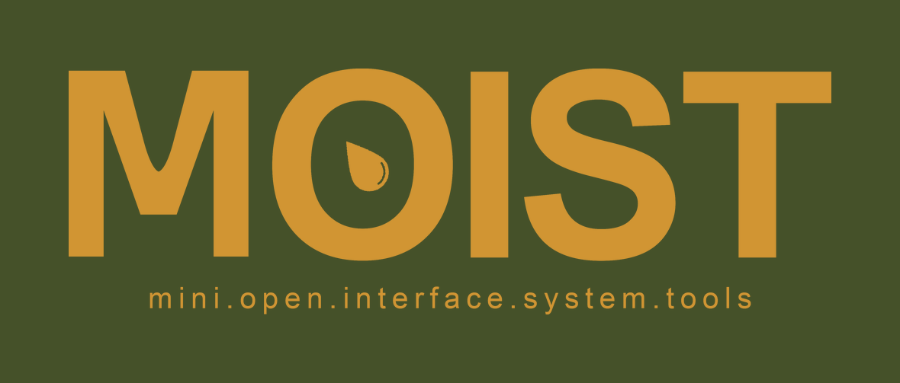

<p align="center">
  
</p>

# MOIST

A small desktop app for photographers, on macOS.

- **ingest** — pull a card, sort by camera and date, no Finder dragging
- **cull** — Bridge-style RAW culler; space to go full screen, arrows to walk, delete to reject
- **drops** — one link anybody can upload to; what they send lands in the app
- **client** — build a gallery and hand it to a client
- **social** — schedule and post the picks
- **print** — 3D printing: slice, repair a mesh, send it to the printer
- **photos** — your own photo library
- **buy** — watch an item, get told when it goes cheap
- **mail** — your inbox, next to the work
- **assistant** — a local AI that runs on your machine, not in the cloud
- **dashboard** — to-dos, calendar, notes

Plus one optional add-on on the same disk image:

- **scrn.brd** — a break-off window that catches every screenshot you take while it's open,
  each with a notes field beside it, and writes the lot to a folder plus one composite image.
  It runs inside [Hammerspoon](https://www.hammerspoon.org/) rather than inside MOIST, because
  it has to see screenshots system-wide. Open the `scrn.brd` folder on the disk image and
  right-click → Open its installer; it'll tell you if Hammerspoon is missing.

Everything runs on your computer. There is no MOIST account, no server of ours, and nothing is uploaded
anywhere. Anything that needs a server is a server *you* run — you paste its address in Settings.

---

## Install

1. Download **`MOIST-*.dmg`** from [Releases](https://github.com/bryanhempstead/moist/releases/latest).
2. Open it.
3. **Right-click `Install MOIST` → Open**, then click Open again when macOS asks.

That's it. It copies MOIST into your Applications folder, clears the flag macOS puts on
downloaded apps, and starts it. You never run it again — updates install themselves.

### Why right-click instead of double-click

MOIST isn't signed with a $99/year Apple certificate, so macOS quarantines it after download
and refuses to open it — usually claiming it's *"damaged"*. It isn't. Right-click → Open is how
macOS lets you run something it can't vouch for, and the installer clears the flag from the app
itself so you only do this once.

If you'd rather do it by hand: drag MOIST into Applications, then in Terminal run

```bash
xattr -cr /Applications/MOIST.app
```

---

## First run

The first launch asks two things — your name, and where your photos live — and then gets out of the way.
Everything else is optional and lives in **settings** (bottom of the sidebar). Nothing is filled in: it's
your machine, so they're your folders and your accounts, and anything left blank simply turns that
feature off.

| | |
|---|---|
| **Where your photos live** | pick a folder. The only required one. |
| **Local AI** | install [Ollama](https://ollama.com) and pull a model. Free, offline, no key. |
| **Photo library server** | only if you run [Immich](https://immich.app) yourself. Leave blank otherwise. |
| **3D printer** | your printer's address on your network. |
| **Mail** | needs a Google OAuth client you create — free, and yours. |
| **Business name** | goes on the drop page your clients upload through, and in its link. |
| **Drops** | pick where uploaded files land. A permanent web address is optional. |
| **Cloud AI key** | optional, and it costs money per use. The local model is free. |

Anything left blank just shows a "point this at your server" card instead of an error. Nothing breaks.

---

## Updates

MOIST checks for a new version when it starts and shows a banner if there is one. Click it, download the
new DMG, and drag it over the old one. Your settings are kept.

There's no silent auto-update, for the same reason as step 3 — that also needs the Apple certificate.

---

## Troubleshooting

**"MOIST is damaged and can't be opened"** — step 3 above wasn't run, or was run before MOIST was moved
into Applications. Move it first, then run it.

**A tab is empty with a "point this at your server" card** — that feature needs a server you haven't set
up. Fill it in under Settings, or ignore the tab.

**The assistant doesn't answer** — Ollama isn't running, or the model is too big for your RAM. Settings
says which, under **local ai**.

---

MOIST is a slice of a larger personal app, packaged to be handed to someone else. It's given as-is, with
no warranty. Bugs and requests: [open an issue](https://github.com/bryanhempstead/moist/issues).
